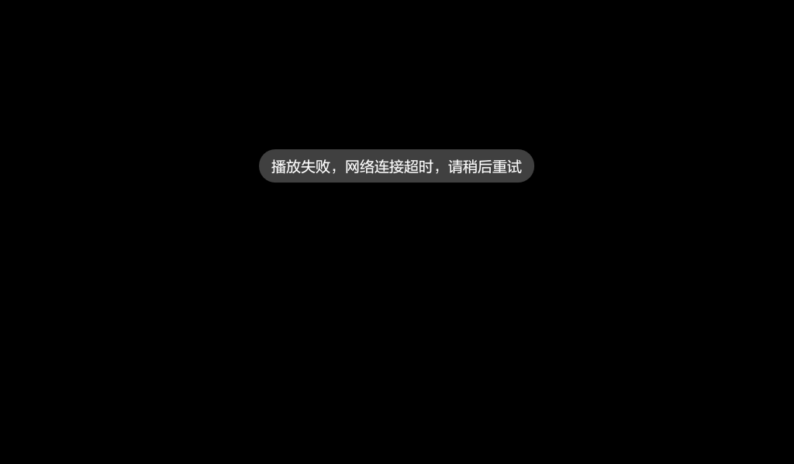
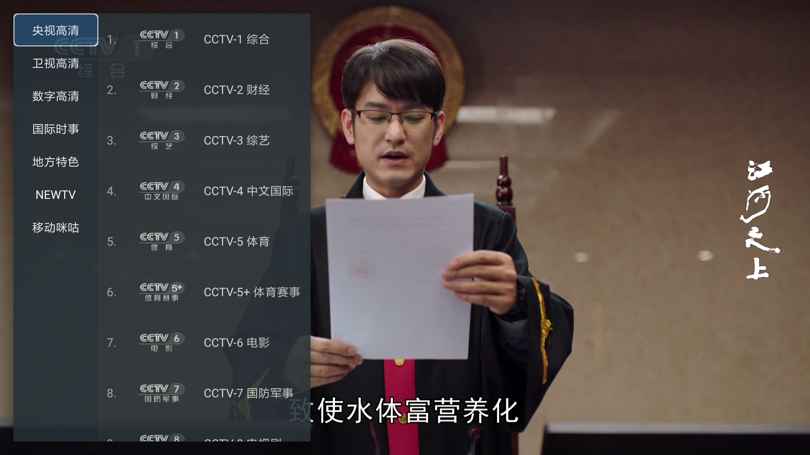
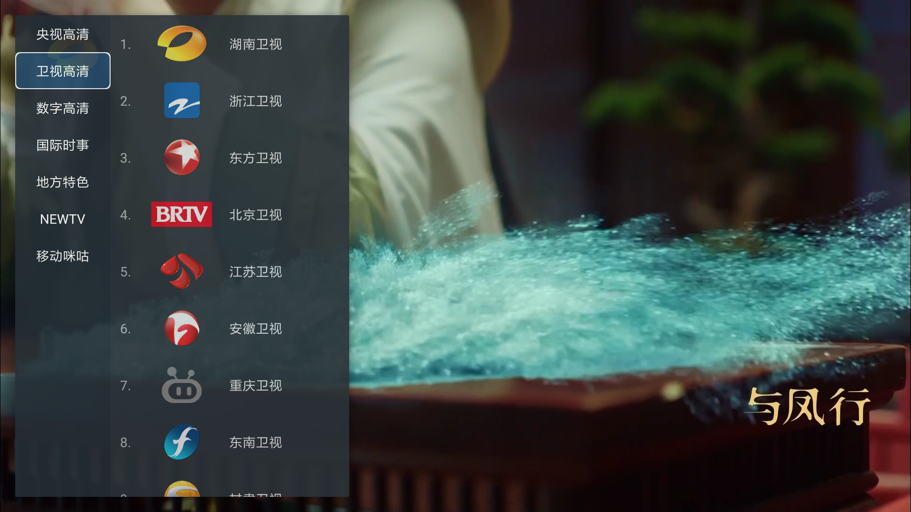
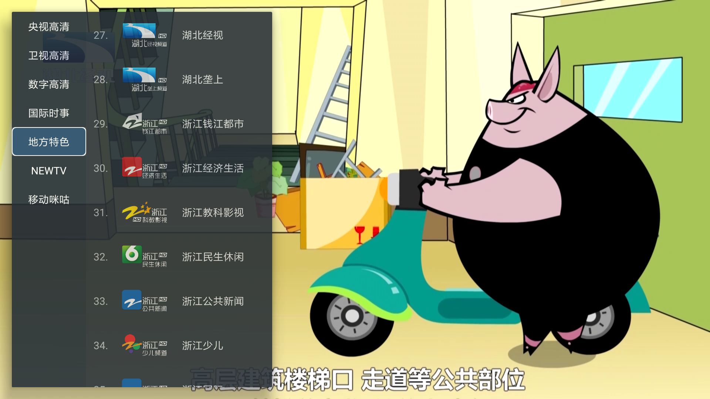

# FAQ

**1.出现“初始化频道列表失败，请尝试手动更新或退出重试”、“播放失败，网络连接超时，请稍后重试”**

1.请尝试手动更新频道源，更新成功之后退出重新进入，如果更新失败请确认网络是否连通

2.如果更新成功后还是无法播放，可能该频道源已失效，请切换频道观看，耐心等待更新修复

# SimpleTV

1.观看电视直播，支持央视和地方台。 操作简单，打开即看，方便中老年人使用，让电视回归本质。  
2.部分频道目前仅支持IPV6网络，IPV4网络无法播放。  
3.IPV6测试[地址](http://test-ipv6.com/)，如显示运营商已接入IPV6但无法访问IPV6网站，需要在路由器设置打开IPV6功能([华为路由器参考](https://consumer.huawei.com/cn/support/content/zh-cn00685838/#:~:text=%E9%80%9A%E8%BF%87%E6%99%BA%E6%85%A7%E7%94%9F%E6%B4%BB%20App%20%E8%AE%BE%E7%BD%AE%201%20%E6%89%8B%E6%9C%BA%2F%E5%B9%B3%E6%9D%BF%E8%BF%9E%E6%8E%A5%E5%88%B0%E8%B7%AF%E7%94%B1%E5%99%A8%E7%9A%84%20Wi-Fi%E3%80%82%202%20%E6%89%93%E5%BC%80%E6%99%BA%E6%85%A7%E7%94%9F%E6%B4%BB,%E7%82%B9%E5%87%BB%20IPv6%20%E3%80%82%20%E7%82%B9%E5%87%BB%20IPv6%20%E5%BC%80%E5%85%B3%EF%BC%8C%E5%BC%80%E5%90%AF%E6%88%96%E5%85%B3%E9%97%AD%20IPv6%20%E5%8A%9F%E8%83%BD%E3%80%82),[小米路由器参考](https://cdn.cnbj1.fds.api.mi-img.com/ics-resources/articles/6055c933ec317cb4ee2d0103.html))  
4.仅支持安卓6.0及以上版本  
5.所有素材及直播源均来源于互联网，**仅供测试研究，不得商用**。如有侵权，请联系我删除。

# 安装

1.下载apk后使用U盘安装（TCL电视系统屏蔽了apk文件，需要用自带的电视卫视进入U盘安装）  
2.使用当贝市场远程推送安装（[参考](https://zhuanlan.zhihu.com/p/588748827#:~:text=%E6%95%99%E7%A8%8B%E4%BB%8B%E7%BB%8D%20%E6%AD%A5%E9%AA%A4%E4%B8%80%EF%BC%9A%20%E9%A6%96%E5%85%88%E6%89%93%E5%BC%80%E5%BD%93%E8%B4%9D%E5%B8%82%E5%9C%BA%E7%9A%84%E7%AE%A1%E7%90%86%E7%95%8C%E9%9D%A2%EF%BC%8C%20%E5%A6%82%E5%9B%BE%E6%89%80%E7%A4%BA%20%E7%9A%84%E4%BD%8D%E7%BD%AE%E5%8F%AF%E4%BB%A5%E7%9C%8B%E5%88%B0%20%E2%80%9C%E8%BF%9C%E7%A8%8B%E6%8E%A8%E9%80%81%E2%80%9D%E7%9A%84%E5%9B%BE%E6%A0%87%20%E6%AD%A5%E9%AA%A4%E4%BA%8C%EF%BC%9A,%E6%9C%89%20%E4%B8%A4%E7%A7%8D%E8%BF%9E%E6%8E%A5%E6%96%B9%E5%BC%8F%20%EF%BC%8C%E8%BF%9C%E7%A8%8B%E6%8E%A8%E9%80%81%E5%BC%80%E5%A7%8B%E5%89%8D%E9%9C%80%E8%A6%81%E5%9C%A8%20%E6%89%8B%E6%9C%BA%E4%B8%8A%E6%8F%90%E5%89%8D%E4%B8%8B%E8%BD%BD%E5%A5%BD%E9%9C%80%E8%A6%81%E6%8E%A8%E9%80%81%E7%9A%84%E8%BD%AF%E4%BB%B6%20%E6%AD%A5%E9%AA%A4%E4%B8%89%EF%BC%9A%20%E4%BD%BF%E7%94%A8%E6%96%B9%E6%B3%95%E4%B8%80%E6%89%8B%E6%9C%BA%E6%89%AB%E7%A0%81%E5%90%8E%E4%BC%9A%20%E8%87%AA%E5%8A%A8%E8%B7%B3%E8%BD%AC%E5%88%B0%E8%BF%9C%E7%A8%8B%E6%8E%A8%E9%80%81%E7%9A%84%E9%A1%B5%E9%9D%A2%20%EF%BC%8C%E7%82%B9%E5%87%BB%E4%B8%8A%E4%BC%A0%E6%96%87%E4%BB%B6%EF%BC%8C%E5%B0%86%E4%B8%8B%E8%BD%BD%E5%A5%BD%E7%9A%84%E6%96%87%E4%BB%B6%E4%B8%8A%E4%BC%A0)）  
3.打开电视开发者模式，连接电脑使用adb安装

# 操作说明

小米遥控器示例

# 频道展示

小米盒子4C

# 致谢

直播来源：  
https://github.com/Meroser/IPTV  
https://github.com/fanmingming/live
